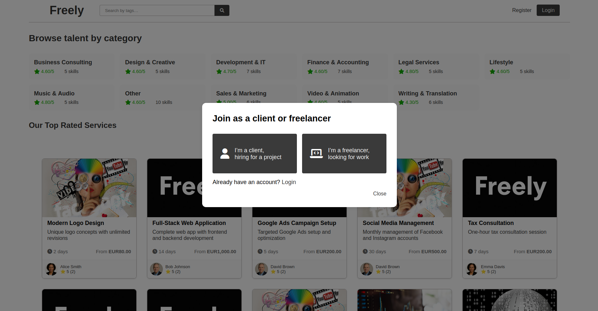
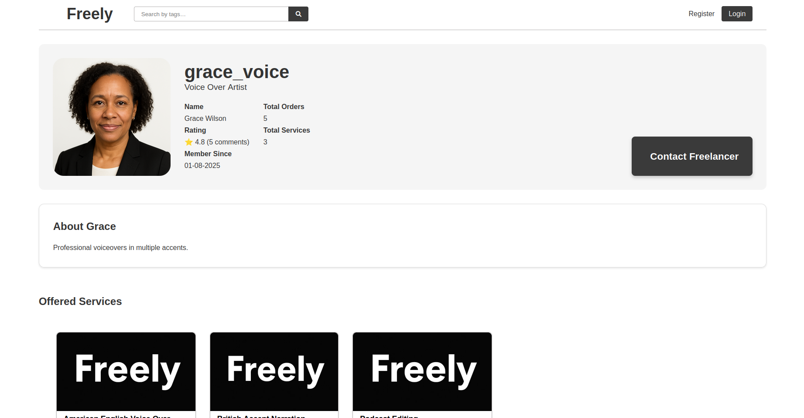

# FREELY

### Context
This project was developed during LTW (Laboratório e Tecnologias Web) class to deepen the understanding of web technologies such as HTML5, CSS, JavaScript (and AJAX), PHP and SQLite. We built a freelancer–client platform where:
- Freelancers can offer services and receive evaluations.
- Clients can browse offers, chat with freelancers, and rate completed jobs.

In terms of Security, we implemented protections against:
- **XSS:** by output escaping with `htmlspecialchars()`
- **CSRF:** by using tokens in forms
- **SQL Injection:** by using prepared statements
- **Password security:** by hashing it with `password_hash()`

## Images

`Main Page`

`Service Page`

`Profile Page`

## Credits
- **[Francisco Antunes](https://github.com/nuno-gomes-67)**
- **[Nuno Gomes](https://github.com/sillss1)**
- **[Pedro Coelho](https://github.com/huimobi)**

## Grade & Retrospective
**Final Grade:** **18,3/20**

This project was my first contact with web development. I learned that input validation and output escaping are very important in order to create a secure website and protect it against the vulnerabilities above. I also acquired some understanding of how HTTP and HTTPS requests work, and why HTTPS —by encrypting data in transit— is essential for protecting users’ information.

## Project Requirements:
**User:**
- [x] Register a new account.
- [x] Log in and out.
- [x] Edit their profile, including their name, username, password, and email.

**Freelancers:**
- [x] List new services, providing details such as category, pricing, delivery time, and service description, along with images or videos.
- [x] Track and manage their offered services.
- [x] Respond to inquiries from clients regarding their services and provide custom offers if needed.
- [x] Mark services as completed once delivered.

**Clients:**
- [x] Browse services using filters like category, price, and rating.
- [x] Engage with freelancers to ask questions or request custom orders.
- [x] Hire freelancers and proceed to checkout (simulate payment process).
- [x] Leave ratings and reviews for completed services.

**Admins:**
- [x] Elevate a user to admin status.
- [x] Introduce new service categories and other pertinent entities.
- [x] Oversee and ensure the smooth operation of the entire system.

**Extra:**
- [x] "Admin panel" so admin can manage users, services and categorys.
- [x] "My Buys" page so users can track the progress of the services they requested or have previously bought.
- [x] "My Services" page so freelancer can manage the services they provide and manage the services they are currently doing.

## Running

    sqlite3 database/database.db < database/database.sql
    php -S localhost:9000

## Credentials (for testing)

- 1@example.com/1234567890 (admin)
- 2@example.com/1234567890
